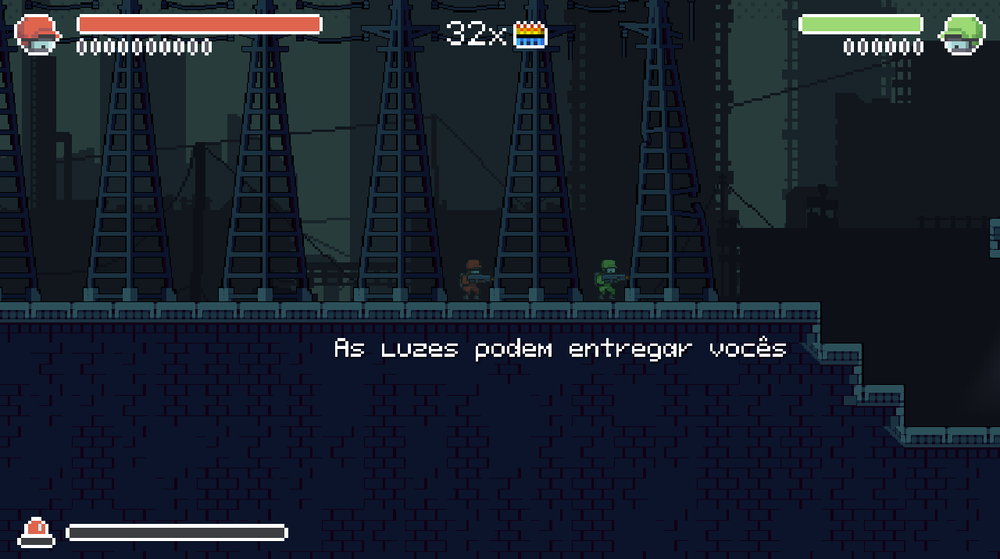

# Projeto Eclipse
Este projeto faz parte de um trabalho da disciplina de `Fundamento de Jogos Digitais`.
Em síntese, é um protótipo de um jogo de tiro cooperativo para exatamente dois jogadores que mistura furtividade e ação.

Como é um protótipo, é bem curto.

# Como jogar
O jogador verde consegue abater inimigos interagindo com eles e integarir com alguns objetos do mapa. O vermelho é bem mais forte, rápido, tem mais balas e consegue jogar o outro jogador para cima.

## Instalação
Os binários do jogo estão disponível [aqui](https://github.com/L-Marcel/Projeto-Eclipse/releases/tag/1.0.0), tanto para `Windows` como para o `Linux`. É só baixar e executar. E não precisa baixar todos os arquivos disponíveis da página. Se vai jogar no `Windows`, baixe os com sufixo `_windows`. Se vai jogar no `Linux`, baixe os com sufixo `_linux`.

Lembrando que você tem que ter permissão para executar o binário.

## Controles - Jogador (vermelho)
- `w, a, s, d` - andar e se agachar;
- `r` - recarregar;
- `j` - atirar;
- `k` - interagir.

## Controles - Jogador (verde)
- `setas` - andar e se agachar;
- `4` - recarregar;
- `1` - atirar;
- `2` - interagir.

*Observações*: em algums teclados, tantas teclas simultaneamente podem falhar. Mas não se trata de uma falha do jogo, e sim de uma falha de hardware (o próprio teclado) ­- que as vezes não suporta tantas teclas precionadas simultaneamente (como é o caso do meu).

### Joystick - Jogador (verde)
Mas o segundo jogador também pode controlar seu personagem por um `joystick`. Os botões são preconfigurados como no caso do teclado. Segue abaixo uma lista de botões considerando um `layout` de um `joystick` modelo `Xbox`:

- `marcha da direita` - andar;
- `A` - pular;
- `LT` - recarregar;
- `RT` - atirar;
- `Y` - interagir.

De modelo para modelo, algo pode mudar além do `layout`.

